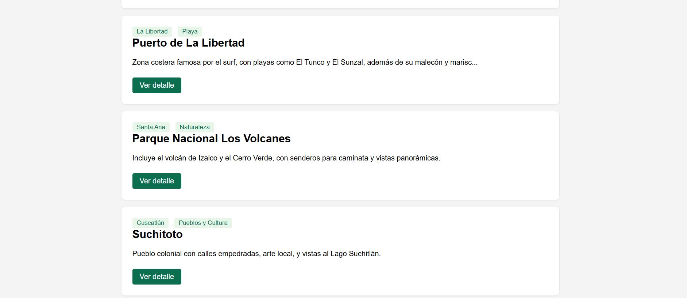
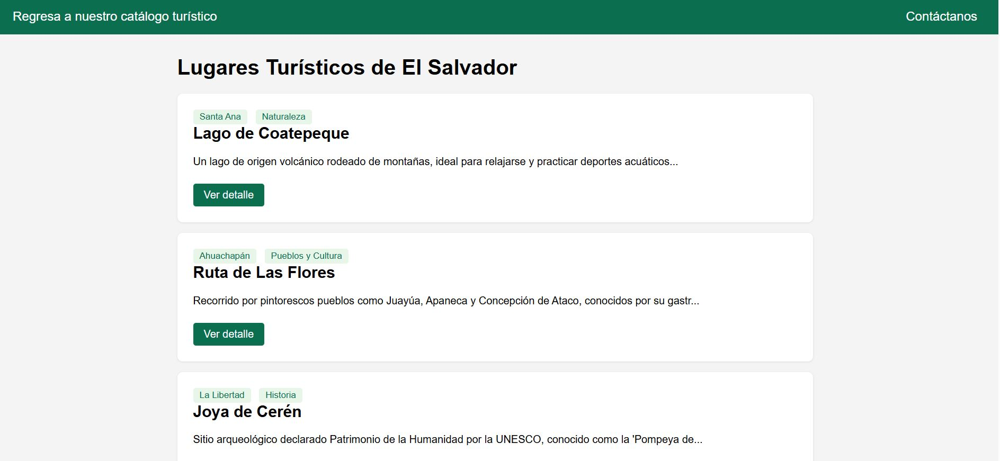
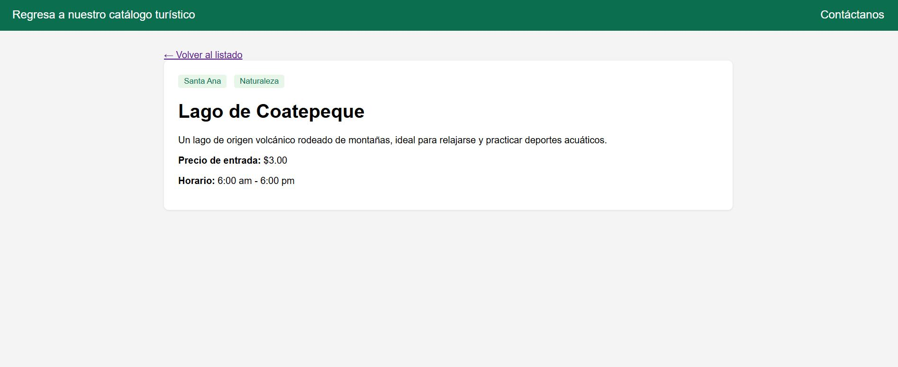
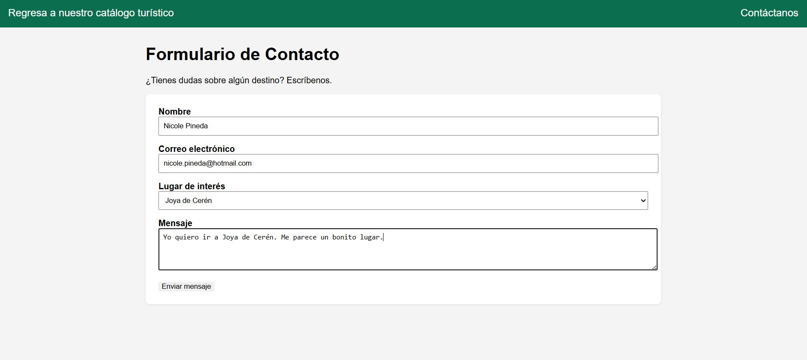
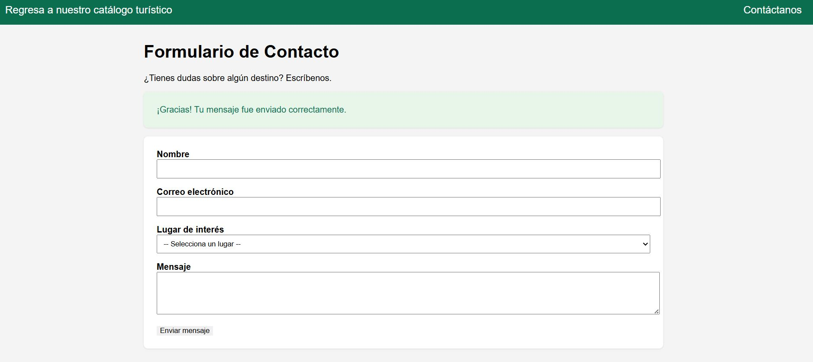

# Catálogo Turístico de El Salvador

Aplicación desarrollada en Laravel que implementa el patrón MVC mediante un catálogo de lugares turísticos de El Salvador, utilizando archivos JSON como fuente de datos.

---

## Instrucciones de instalación

1. Clonar el repositorio en tu dispositivo.
2. Abrir la carpeta del proyecto en Visual Studio Code.
3. Utilizar el comando `php artisan serve`.
4. Utilizar la URL `localhost:8000/lugares` o `127.0.0.1:8000/lugares`.

---

## Descripción del flujo MVC implementado

Ejemplo con la petición `GET /lugares`:

1. **Ruta** (`routes/web.php`): recibe la petición HTTP y la dirige al controlador correspondiente.
2. **Controlador** (`LugarController`): solicita los datos al Modelo, sin conocer cómo se obtienen internamente.
3. **Modelo** (`Lugar`): lee y transforma el archivo `lugares.json` (ubicado en `storage/app/private/data/lugares.json`) usando el facade `Storage`, y lo devuelve como un arreglo de datos.
4. **Vista** (`resources/views/lugares/index.blade.php`): recibe los datos desde el Controlador y los renderiza como HTML para el usuario final.

El mismo flujo aplica para el detalle de un lugar (`GET /lugares/{id}`, con `LugarController@show` y la vista `lugares/show.blade.php`).

Para el formulario de contacto, el flujo cambia en la última etapa: en lugar de solo leer datos, el Modelo `Mensaje` **escribe** un nuevo registro en `mensajes.json`:

1. **Ruta** `POST /contacto` recibe el envío del formulario.
2. **Controlador** (`ContactoController@store`) valida los datos recibidos (`$request->validate()`).
3. **Modelo** (`Mensaje`) guarda el mensaje validado en `mensajes.json` mediante `Storage::put()`.
4. El usuario es redirigido de vuelta al formulario con un mensaje de confirmación.

---

## Capturas de pantalla del sistema funcionando

### Listado de lugares

### Detalle de un lugar

### Formulario de contacto

### Confirmación de envío

